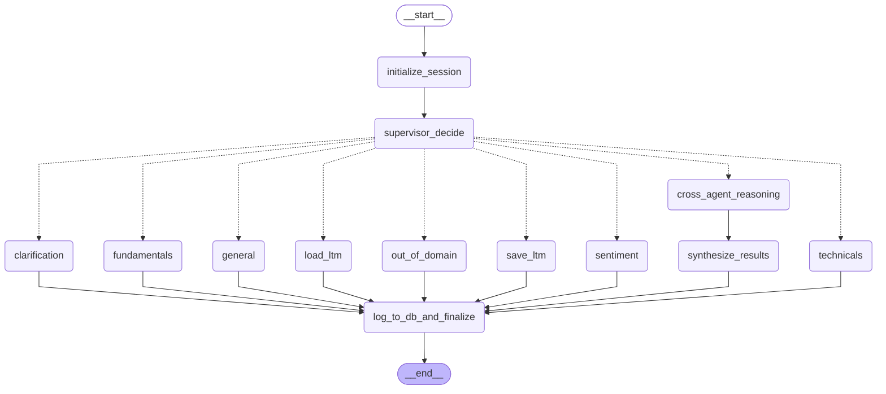

### IRIS Agent Graph Diagram

```mermaid
---
config:
  flowchart:
    curve: linear
---
graph TD;
	__start__([<p>__start__</p>]):::first
	initialize_session(initialize_session)
	supervisor_decide(supervisor_decide)
	save_ltm(save_ltm)
	load_ltm(load_ltm)
	fundamentals(fundamentals)
	technicals(technicals)
	sentiment(sentiment)
	cross_agent_reasoning(cross_agent_reasoning)
	clarification(clarification)
	general(general)
	out_of_domain(out_of_domain)
	synthesize_results(synthesize_results)
	log_to_db_and_finalize(log_to_db_and_finalize)
	__end__([<p>__end__</p>]):::last
	__start__ --> initialize_session;
	clarification --> log_to_db_and_finalize;
	cross_agent_reasoning --> synthesize_results;
	fundamentals --> log_to_db_and_finalize;
	general --> log_to_db_and_finalize;
	initialize_session --> supervisor_decide;
	load_ltm --> log_to_db_and_finalize;
	out_of_domain --> log_to_db_and_finalize;
	save_ltm --> log_to_db_and_finalize;
	sentiment --> log_to_db_and_finalize;
	supervisor_decide -.-> clarification;
	supervisor_decide -.-> cross_agent_reasoning;
	supervisor_decide -.-> fundamentals;
	supervisor_decide -.-> general;
	supervisor_decide -.-> load_ltm;
	supervisor_decide -.-> out_of_domain;
	supervisor_decide -.-> save_ltm;
	supervisor_decide -.-> sentiment;
	supervisor_decide -.-> technicals;
	synthesize_results --> log_to_db_and_finalize;
	technicals --> log_to_db_and_finalize;
	log_to_db_and_finalize --> __end__;
	classDef default fill:#f2f0ff,line-height:1.2
	classDef first fill-opacity:0
	classDef last fill:#bfb6fc

```
